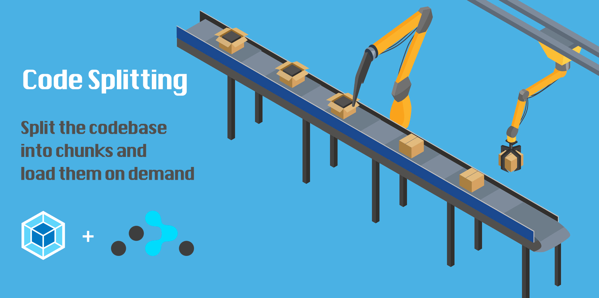

# How to Code Split with React Router and Webpack 2

<br />

## About

Webpack is an awesome tool for bundling front end assets including JavaScript, CSS etc. The output bundle size can be big and that will cause loading slowness and poor user experiences, we should only load the assets on demand for each route.

Luckily React Router allows us to load the components asynchronously and Webpack can bundle the components into chunks. For example, there are three routes, and Each route is associate with a React component:

- /home (Home.js)
- /about (About.js)
- /users (Users.js)

You don't want to bundle them all into one giant App.js. In React Router, we can use System.import (or requre.ensure) to load each component for each route, like so:

```javascript
getComponent(location, cb) {
  require.ensure([], (require) => {
    cb(null, require('./components/Home').default)
  }, 'Home'); // Output Home.chunk.js
}
```

or 

```javascript
getComponent(location, cb) {
  System.import('./components/Home' /* webpackChunkName:'Home' */)
    .then(loadRoute(cb, false))
    .catch(errorLoading);
},
```

Then all we need to do in the Webpack config is to specify the chunk filename:

```
output: {
  ...
  chunkFilename: '[name].[chunkhash].chunk.js',
  ...
},
```

Now when you navigate to each route, only the necessary component will be loaded.

## Quick start

1. Clone this repo using `git clone https://github.com/jeantimex/react-webpack-code-splitting.git`
2. Run `yarn` or `npm install` to install the dependencies
3. Run `yarn start` and see the example app at `http://localhost:3000`

## License

This project is licensed under the MIT license, Copyright (c) 2017 Yong Su. For more information see `LICENSE.md`.
